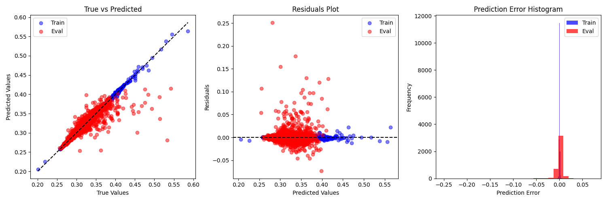

# Unimol Model for Sequence Classification

This repository implements the `Unimol` architecture for molecular sequence classification, based on the `transformers` library. It provides a flexible and extendable structure for working with the Uni-Mol framework, allowing for easy modification or extension. 

The implementation is a **transformers migration** of `dptech/unimol_tools`, specifically designed to work with organic molecules. It includes the corresponding tokenizer for organic molecules but does **not** support predictions for other types of materials, such as MOFs (Metal-Organic Frameworks) or OLEDs (Organic Light Emitting Diodes).

The codebase follows the structure of `transformers`, making it simple to adapt for different use cases and extend for additional functionality in the future.


## Scripts Overview

### 1. `test.py`

This script is used to test the model's inference capabilities on a list of SMILES strings. It demonstrates how to load a pretrained model and tokenizer, prepare molecular data, and perform inference.

#### Key Functions:
- **Loading the model and tokenizer**:  
  Use the following code to load a pretrained `UnimolForSequenceClassification` model and tokenizer:
  ```python
  model = UnimolForSequenceClassification.from_pretrained('pretrained/hg_unimol')
  tokenizer = UnimolTokenizer.from_pretrained('pretrained/hg_unimol')
  ```

- **Encoding SMILES strings**:  
  SMILES strings can be encoded into model input using the `encode` method of the tokenizer:
  ```python
  encoded = tokenizer.encode(smiles, add_special_tokens=True, use_3d=True)
  ```

- **Performing inference**:  
  The encoded data is passed into the model for inference:
  ```python
  model.to("cuda")
  logits = model(**encoded)
  print(logits)
  ```

#### Example Usage:
```bash
python test.py
```

### 2. `run.py`

This script is used for training the `UnimolForSequenceClassification` model on a dataset of SMILES strings and labels, with optional evaluation.

#### Key Functions:
- **Preparing the dataset**:  
  The dataset is read from an Excel file containing SMILES strings and corresponding labels. Each SMILES string is encoded using the tokenizer:
  ```python
  encoded = tokenizer.encode(smiles, add_special_tokens=True, use_3d=True)
  ```

- **Training the model**:  
  The `Trainer` class is used to train the model with the dataset:
  ```python
  trainer = Trainer(model, dataset, params)
  trainer.train()
  ```

- **Evaluation**:  
  The model can be evaluated using the `CustomTest` class:
  ```python
  test = CustomTest(trainer)
  test.run()
  ```

  Here are the training results visualized in the following chart:

  

#### Example Usage:
```bash
python run.py
```

### 3. `move_weights.py`

This script is used to migrate the state dictionary (`state_dict`) from the `dptech/unimol` implementation to this implementation. It performs necessary adjustments to layer names and weights to ensure compatibility with the `Unimol` model.

#### Key Functions:
- **Loading the state_dict from `dptech/unimol`**:  
  The pretrained weights from `dptech/unimol` are loaded as follows:
  ```python
  cache = torch.load("pretrained/dptech_unimol/mol_pre_all_h_220816.pt")['model']
  ```

- **Renaming and reorganizing layers**:  
  The state_dict keys are renamed and reorganized to match the new model architecture. For example:
  ```python
  key = key.replace("encoder", "unimol")
  ```

- **Saving the new state_dict**:  
  After all necessary modifications, the updated state_dict is saved:
  ```python
  torch.save(new_cache, "moved_weight.pt")
  ```

#### Example Usage:
```bash
python move_weights.py
```

## Folder Structure

```bash
├── model
│   ├── modeling_unimol.py       # Model definition for Unimol
│   ├── configuration_unimol.py  # Configuration for the Unimol model
│   ├── tokenization_unimol.py   # Tokenizer for the Unimol model
├── utils
│   ├── data_collator.py         # Data collator to batch the data
│   ├── trainer.py               # Trainer class for model training
├── pretrained
│   ├── hg_unimol                # Pretrained model and tokenizer
├── run.py                       # Training script
├── test.py                      # Inference testing script
├── move_weights.py              # Script to migrate weights
└── requirements.txt             # Python dependencies
```


## Notes

This work is based on **Uni-Mol tools for property prediction, representation, and downstreams**. Uni-Mol tools are easy-to-use wrappers for property prediction, representation, and downstream tasks with Uni-Mol. It includes the following tools:
- Molecular property prediction with Uni-Mol.
- Molecular representation with Uni-Mol.
- Other downstream tasks with Uni-Mol.

For more details, check the [https://github.com/deepmodeling/Uni-Mol/](unimol_tools) repository.
Documentation for Uni-Mol tools is available at: [https://unimol.readthedocs.io/en/latest/](https://unimol.readthedocs.io/en/latest/).
